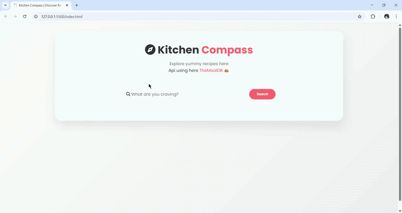

# Kitchen Compass | Discover Recipes
A responsive web application that allows users to explore thousands of recipes in real-time using **TheMealDB API**. This project demonstrates clean ES6+ logic, mobile-first design, and seamless UI transitions.

## ✨ Key Features
* **Dynamic Recipe Search:** Real-time fetching of meal data based on user keywords.
* **Interactive UI:** Features a custom rotating search placeholder and smooth "exit-up" animations.
* **Detailed View:** Seamlessly toggles between the search results grid and a comprehensive recipe breakdown (ingredients + instructions).
* **YouTube Integration:** Direct links to video tutorials for supported recipes.
* **Fully Responsive:** Optimized for all devices using CSS Grid and Media Queries.

## 🛠️ Tech Stack
* **Frontend:** HTML5, CSS3
* **Logic:** Vanilla JavaScript
* **API:** [TheMealDB](https://www.themealdb.com/api.php)
* **Icons:** FontAwesome 6.7.2
* **Typography:** Google Fonts (Poppins)

## 🚀 Live Demo
You can explore the live application here:  
**[Click here to explore Kitchen Compass Live!](https://syanx24.github.io/Kitchen-Compass/)**

## 🛠️ Clone project
If you want to run this locally:
1. Clone the repo: `git clone https://github.com/Syanx24/Kitchen-Compass.git`
2. Open `index.html` in your browser.
